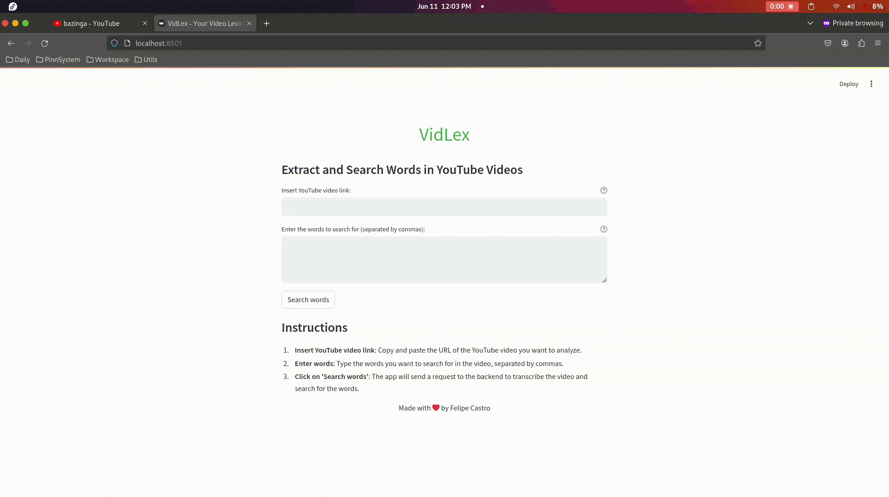

  

    <h1>
      
       
      VidLex
    </h1>
    <h4>Extract and Search Words in YouTube Videos</h4>
  

 

## Preview

## Features

- Customizable appearance.
- Easy to use.
- In-app screenshot editing.
- DBus interface.
- Upload to Imgur.

## Contribute

If you want to contribute check the [CONTRIBUTING.md](docs/CONTRIBUTING.md)